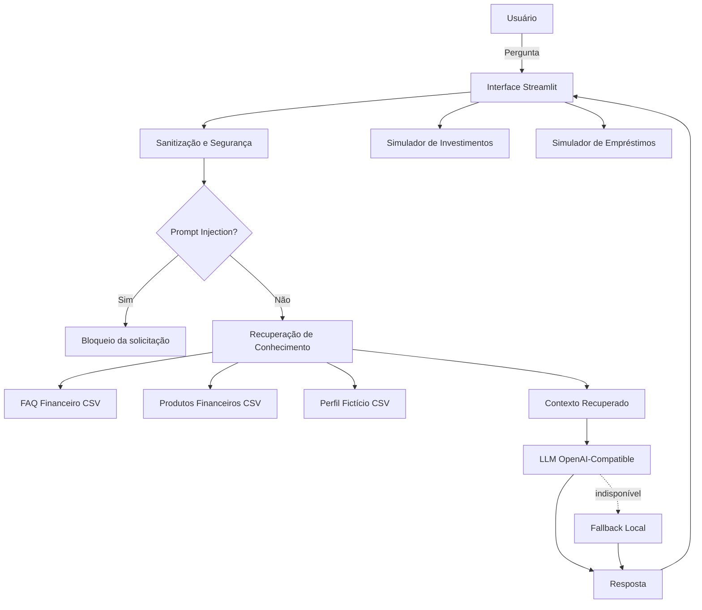

# Documentação do Agente

## Caso de Uso

### Problema

> Qual problema financeiro seu agente resolve?

Muitas pessoas possuem dúvidas sobre conceitos financeiros, orçamento, crédito, investimentos e organização das finanças, mas encontram informações dispersas ou difíceis de interpretar. Além disso, uma pessoa pode ter dificuldade para transformar conceitos financeiros em simulações práticas.

O FinAssist IA foi criado para centralizar essas informações em uma interface conversacional simples, permitindo consultar conhecimentos financeiros, visualizar informações de um perfil fictício e realizar simulações educativas de investimentos e empréstimos.

### Solução

> Como o agente resolve esse problema de forma proativa?

O FinAssist IA recebe a pergunta do usuário, sanitiza a entrada para remover possíveis dados sensíveis, verifica tentativas de manipulação das instruções e consulta uma base de conhecimento financeira antes de gerar a resposta.

Quando uma integração com um modelo de IA generativa está configurada, o agente utiliza o contexto recuperado da base para produzir uma resposta em linguagem natural. Caso a IA generativa não esteja disponível, o sistema utiliza um mecanismo de fallback local.

Além do chat, o sistema disponibiliza simuladores de juros compostos e empréstimos, permitindo que o usuário transforme conceitos financeiros em exemplos numéricos.

### Público-Alvo

> Quem vai usar esse agente?

O agente é voltado principalmente para pessoas que desejam aprender sobre finanças pessoais e compreender conceitos como orçamento, reserva de emergência, CDI, crédito, empréstimos e investimentos.

Também pode ser utilizado em demonstrações educacionais de aplicações que combinam Inteligência Artificial Generativa, dados, Python e cibersegurança.

---

## Persona e Tom de Voz

### Nome do Agente

**FinAssist IA**

### Personalidade

> Como o agente se comporta? (ex: consultivo, direto, educativo)

O FinAssist IA possui uma personalidade **educativa, consultiva, clara e responsável**.

Ele procura explicar conceitos financeiros de forma simples, sem assumir o papel de consultor financeiro pessoal. Quando não possui informação suficiente, evita inventar dados e orienta o usuário a reformular a pergunta ou consultar informações mais específicas.

O agente também prioriza segurança, evitando solicitar ou processar credenciais, senhas, tokens, CVV, PIN ou outros dados sensíveis.

### Tom de Comunicação

> Formal, informal, técnico, acessível?

O tom é **acessível, profissional e didático**, utilizando português do Brasil.

A linguagem evita excesso de termos técnicos e, quando um conceito financeiro exige conhecimento específico, procura explicá-lo de maneira simples e contextualizada.

### Exemplos de Linguagem

* **Saudação:** "Olá! Sou o FinAssist IA. Posso ajudar com dúvidas sobre finanças, orçamento e simulações."
* **Confirmação:** "Entendi. Vou consultar a base de conhecimento e verificar as informações disponíveis."
* **Erro/Limitação:** "Não encontrei uma informação confiável para responder a essa pergunta. Posso ajudar com conceitos financeiros básicos, orçamento ou simulações educativas."
* **Segurança:** "Por segurança, removi informações que poderiam identificar uma pessoa. Faça a pergunta novamente sem CPF, cartão, senha ou outros dados sensíveis."

---

## Arquitetura

### Diagrama

### Componentes

| Componente              | Descrição                                                                                                               |
| ----------------------- | ----------------------------------------------------------------------------------------------------------------------- |
| Interface               | Aplicação web construída com Streamlit, contendo chat, seleção de perfil e simuladores financeiros.                     |
| LLM                     | Modelo generativo opcional conectado por meio de um endpoint compatível com a API OpenAI.                               |
| Base de Conhecimento    | Arquivos CSV contendo perguntas frequentes, produtos financeiros e perfis fictícios de clientes.                        |
| Recuperação de Contexto | Mecanismo simples de busca por palavras-chave que identifica conteúdos relevantes na base antes da geração da resposta. |
| Fallback                | Mecanismo local utilizado quando a IA generativa não está configurada ou não está disponível.                           |
| Segurança               | Sanitização de dados sensíveis e identificação de padrões de prompt injection antes do processamento da pergunta.       |
| Simuladores             | Funções em Python para calcular juros compostos e estimar parcelas e custo total de empréstimos.                        |
| Dados de Demonstração   | Perfis financeiros fictícios utilizados exclusivamente para demonstrar a aplicação.                                     |

---

## Segurança e Anti-Alucinação

### Estratégias Adotadas

* [x] **O agente utiliza uma base de conhecimento antes de responder perguntas factuais**, reduzindo a possibilidade de respostas desconectadas dos dados disponíveis.
* [x] **As respostas provenientes da base podem apresentar a fonte da informação**, permitindo identificar de onde o conteúdo foi recuperado.
* [x] **Quando não encontra informação relevante, o agente admite a limitação**, em vez de inventar uma resposta específica.
* [x] **Entradas contendo CPF, número de cartão, senha, CVV, CVC, token ou PIN são sanitizadas antes do processamento.**
* [x] **Tentativas comuns de prompt injection são identificadas e bloqueadas.**
* [x] **O prompt do modelo instrui o agente a não inventar taxas, contratos, políticas ou dados de clientes.**
* [x] **Os dados dos clientes utilizados na aplicação são fictícios.**
* [x] **As simulações são identificadas como demonstrativas e não como operações financeiras reais.**
* [x] **O agente não solicita credenciais ou códigos de autenticação.**
* [x] **A integração com IA generativa é opcional, permitindo executar o projeto utilizando o fallback local.**

### Limitações Declaradas

> O que o agente NÃO faz?

O FinAssist IA possui as seguintes limitações:

* Não acessa contas bancárias reais.
* Não realiza transferências, pagamentos ou qualquer operação financeira.
* Não consulta dados bancários reais de usuários.
* Não utiliza os perfis demonstrativos como informações de clientes reais.
* Não solicita ou utiliza senha, PIN, CVV, token ou códigos de autenticação.
* Não fornece garantia de aprovação de crédito.
* Não substitui um profissional ou instituição financeira.
* Não deve ser utilizado como única fonte para decisões financeiras reais.
* As simulações de investimento e empréstimo são apenas estimativas matemáticas e não representam propostas comerciais.
* A qualidade das respostas generativas depende do modelo utilizado quando a integração com LLM estiver habilitada.
* O modo local possui conhecimento limitado à base de dados e às regras implementadas no projeto.

### Objetivo da Aplicação

O FinAssist IA demonstra, em um único projeto, a integração entre **Inteligência Artificial Generativa, manipulação de dados, Python, experiência conversacional e práticas básicas de cibersegurança**, oferecendo uma aplicação educacional voltada ao contexto financeiro.
